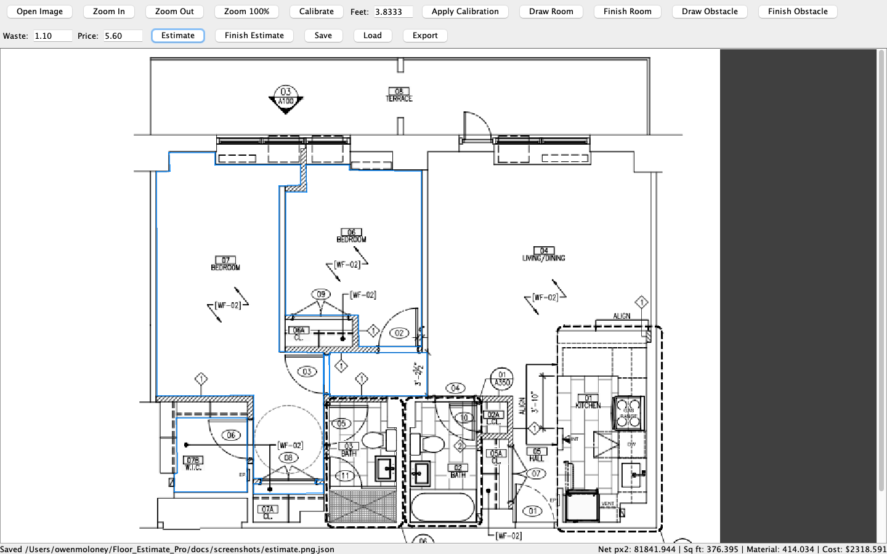
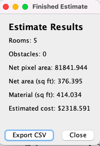

# Floor Estimate Pro

Desktop Java app that turns floor-plan images into square-footage and cost estimates.

[](https://github.com/owenmoloney/floor-estimate-pro/actions/workflows/ci.yml)





## Features

- Open a floor-plan image and zoom to inspect detail
- Calibrate scale from a known real-world length (feet per pixel)
- Draw room polygons and obstacle polygons on the plan
- Estimate net square footage with a configurable waste factor
- Apply a price per square foot for a quick cost estimate
- Save / load projects as JSON
- Export estimate results as CSV

## Tech stack

| Layer | Choice |
| --- | --- |
| Language | Java 17 |
| UI | Swing |
| Build | Maven |
| JSON | Gson |
| Tests | JUnit 5 |

## Quick start

**Requirements:** JDK 17+ and Maven 3.8+

```bash
# Run unit tests
mvn test

# Launch the desktop app
mvn exec:java
```

### Typical workflow

1. **Open Image** — load a floor-plan PNG/JPG
2. **Calibrate** — click two points on a known length, enter feet, **Apply Calibration**
3. **Draw Room** — click polygon vertices, then **Finish Room**
4. **Draw Obstacle** (optional) — subtract cabinets, islands, etc.
5. Set **Waste** (e.g. `1.10` = 10% overage) and **Price** ($/sq ft)
6. **Estimate** — view net area and cost
7. **Save** / **Export** — persist the project or export CSV

## Project structure

```
src/main/java/com/floorestimatepro/
├── App.java                 # Entry point
├── model/                   # Domain: geometry, calibration, estimates
├── ui/                      # Swing UI and plan canvas
├── persistence/             # JSON save / load
└── export/                  # CSV export
```

Domain logic (polygon area, calibration, estimates) lives in `model/` and is covered by unit tests, separate from the Swing UI.

## What this project demonstrates

- Separating domain logic from UI so geometry and pricing can be tested without Swing
- Real-world calibration (known length → feet-per-pixel) applied to polygon areas
- Obstacle subtraction and waste/price factors for practical estimates
- Persistence (JSON via Gson) and a simple CSV export path
- Maven project layout with JUnit 5 coverage for model, persistence, and export

## License

MIT — see [LICENSE](LICENSE).
